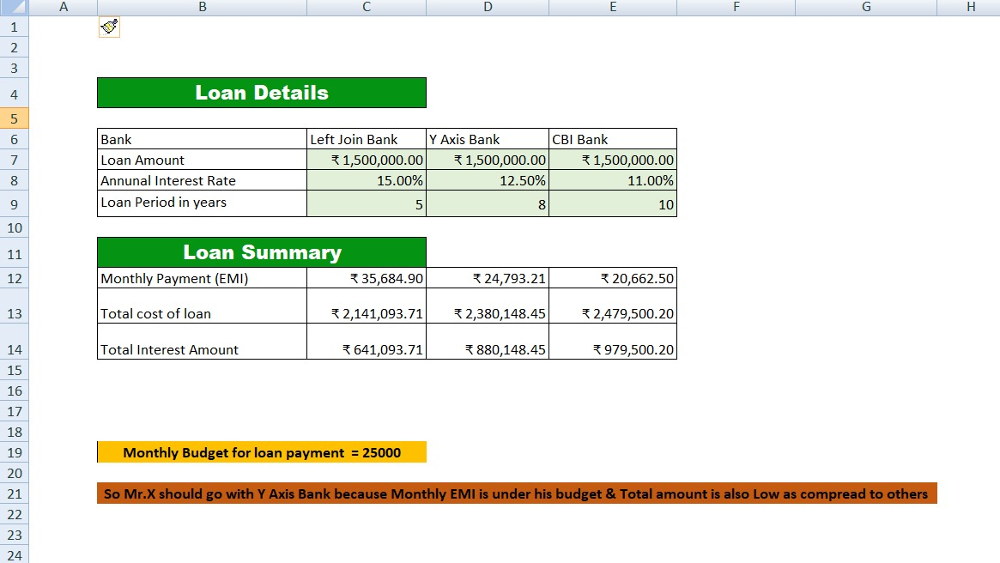

# excel-loan-analysis
Loan EMI Analysis using Excel

# Excel Loan Analysis Project

## 📊 Dashboard Preview

## Objective
To compare loan offers from different banks and select the best option based on EMI and total cost.

## Tools Used
- Microsoft Excel
- PMT Function

## Key Insights
- EMI calculated using PMT formula
- Total cost and interest derived
- Budget constraint: ₹25,000

## Conclusion
Y Axis Bank is the best option as:
- EMI is within budget
- Total cost is lower compared to others

## Files Included
- Excel file
- Output screenshot
